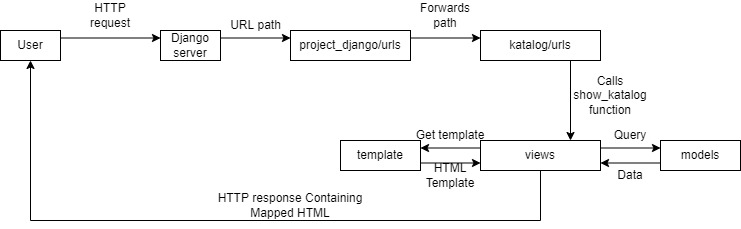

## Deployment URL
https://pbp-2006489634.herokuapp.com/katalog/

## Diagram

  
When a user sends a request to the server, the server forwards the path to django_project/urls.py which then frowards all request to paths that starts with katalog/ to katalog/urls.py. if the URL path matches with a path in katalog/urls.py, it calls the appropriate function in vews.py. the function gets data from the database using the object from models.py. The data is then mapped to the HTML template. Then, the function returns the mapped HTML page which is then sent to the user by the server through an HTTP response.

## Why use a virtual environment

A virtual environment is used so that different application may run different version of a module. We can still create a Django web application without a virtual environment. However, applications with conflicting dependencies won't be able to run simultaneously

## Implementation Process

### 1. Create a function on views.py that can do querying into models and returns the data into a HTML.

The show_katalog function queries the database for every data with the type `CatalogItem` using the following code:  
`data_wishlist = CatalogItem.objects.all()`  
The function then maps the template with the context using the render function. The function returns a HTTP response which contains the template katalog.html that has been mapped.

### 2. Create a routing to map the function that you've created in views.py.

The routing is done by project_django/urls.py. it routes every request of the path /katalog to katalog/urls.py which then runs the show_katalog function in views.py

### 3. Map the data that has been returned into HTML by using Django syntax for templates and data mapping.

The data is mapped into HTML by using template and Django Template Language. The data is mapped by the show_katalog function in views.py.

### 4. Deploy your assignment into Heroku so that your friends and your teaching assistants can access it via the Internet.

To depoloy to heroku, add new repository secrets with key-value pair of heroku api key and heroku app name in the Github repository.