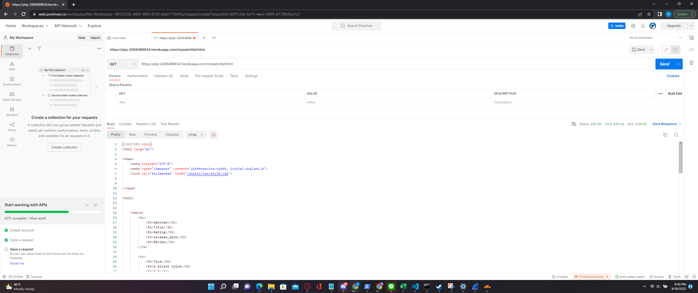
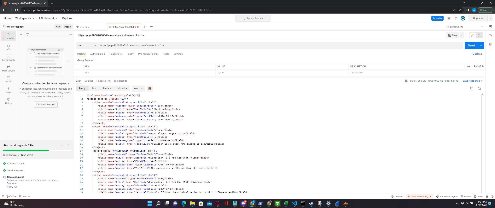
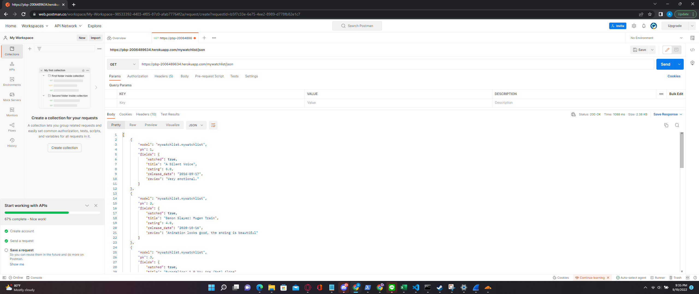

# Assignment 3

## The Difference Between JSON, XML, and HTML!

- HTML is a markup language that is primarily used to give structure to a document that is to be displayed in a browser.

- XML is a markup laguage that is used for storing and transmiting data.

- JSON is a file format used in transmitting data and uses the notation of javascript objects.  

## Why We Need Data Delivery in Implementing a Platform

Whenever a user accesses our application, the server will need to transfer data to the user. In cases such as this, we will need data delivery.

## The Implementations
- The implementation for HTML uses templates and the `django.shortcuts.render` function. The function takes the template and fills the necessary context. then it returns the rendered HTML in the form of an HTTP response.

- The implementation for XML uses the `django.core.serializer.serialize` function which takes the data from the database and formats them into XML.

- The implementation for XML uses the `django.core.serializer.serialize` function which takes the data from the database and formats them into JSON.

## Screenshots

- HTML  

- XML  

- JSON  
